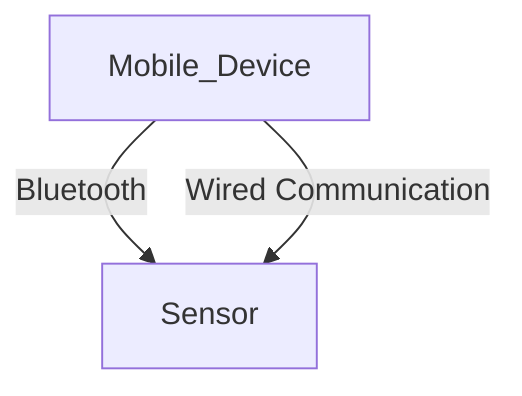

# Challenge - 5

# Usecase

- In our internal project - SITRANS mobile IQ, we configure the devices by sending the MODBUS parameters over bluetooth. In few of the field device scenarios we come across such a challenge, where you have to send alot of MODBUS parametes. Since bluetooth is wireless mode of communication, it is really challenging to achieve the desired speed of configuration. Hence, we have decided to create an adaptor that can help us configure the devices using MODBUS over serial communication. As it is the wired communication, it will much faster.

# Drawbacks

- Not all the device support the serail communication
- Few devices support serial communication, yet the serial port is covered by the device housing.

# Why this usecase?

- This is a real time usecase that can add value to our customers, who wants to use a wired mode of communication for faster response during configuration
- It really needs the domain knowledge for someone to create the source code from scratch

# Technology

- Javascript
- Angular
- Ionic

# Approach

# Outcome

PoC -> For transfering MODBUS params to device over serial

_Wired communication with the sensor_

# Contributors

- Ravi Raj
- Shakeeb
- Kishore
- Hardik
